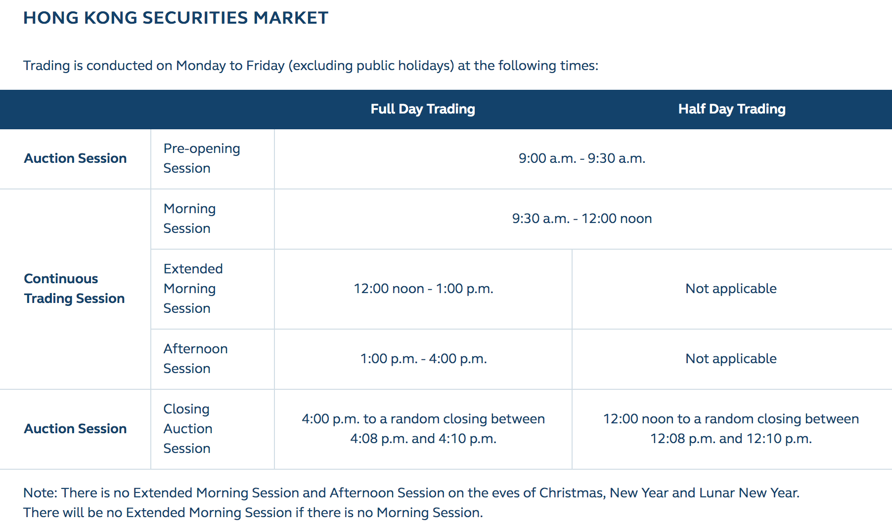

# Basic_Financial_Knowledge_cn 基础金融知识

## 上交所、深交所

### 上交所、深交所有什么特点？

1. 上海证券交易所有**主板**和**新三板**，深圳证券交易所有**主板**, **中小板**和**创业板**。
1. 上交所上市企业的规模更大，新上市企业数量相对较少。
1. 深交所上市企业规模偏小，但数量上会多一些。 
1. 在深市上市的公司市盈率普遍比沪市高，估值也高，当然也具备一些成长性优势。
1. 交易费用不同，上海证券交易所有过户费(上交所收取 1 元的过户费)，而深圳证券交易所没有过户费。

### 中国股市开盘时间

1. 周一至周五，中国股市是上午为前市，9:15至9:25为开盘集合竞价时间，9:30至11:30为连续竞价时间。下午为后市，13:00至14:57为连续竞价时间，14:57至15:00为收盘集合竞价时间。
1. 上午9：15～9：25为集合竞价时间，其中9：15—9：20可以撤单，9：20—9：25不能撤单，9：25以成交量最大的价格为开盘价。
1. 双休日和国家法定节假日如春节，国庆节等股市不开盘。
1. 晚上12点以后的出价，是预埋单交易，具体的时间你和你开户的证券公司了解。是你挂价出来以后，又证券公司电脑帮你记录，第二天早晨证券公司代你委托到交易所。

### 常有股票代码格式？

1. 股票代码命名不同，沪市 60××××，比如 601117 中国化学，深市 00××××，比如 000002
1. 上交所股票代码以 6 开头，全部都属于主板;
1. 深交所股票分为三类：以 000，001 开头的是深圳主板，以 002 开头的为中小板;以 300 开头的为创业板

深证所证券代码采用六位数的数字型编制方法。**首位代码**为**证券品种**区别代码。其中0字开头的代码为A股证券及其衍生品种的证券代码；1字开头的代码为基金、债券及其衍生品种的证券代码；2字开头的代码为B股股票及其衍生品种的证券代码；3字开头的代码为创业板股票及其衍生品种、**指数**、统计指标、网络投票的证券代码；4字开头的代码为代办转让股票等的证券代码。

### 上交所、深交所交易规则、交易费用？

证券交易费用，是指投资者在委托买卖证券时应支付的各种税收和费用的总和。 交易费用通常包括印花税、佣金、过户费、其他费用等几个方面的内容。

深市最后三分钟采用集合竞价，

深市最后三分钟采用集合竞价，也就是说与开盘价的确定方式一样，部分小盘股容易被大资金操纵，出现极端走势。沪市收盘价按最后一分钟的平均成交价确定，相对合理一些，但也存在最后一分钟交易猛增的情况，特别是最后一分钟内买入的价格有可能会低于收盘价，从而直接产生亏损。

## 港交所

### 港交所交易什么？

* 证券市场
	* 股本证券：即股票
		* 主板
		* 创业板
	* 合订证券
	* 债务证券
	* 单位信托／互惠基金
		* 交易所买卖基金
		* 房地产投资信托基金
	* 结构性产品
	* 衍生权证
	* “牛熊证”
	* 股票挂钩票据
* 衍生产品市场
	* 股市指数产品
		* 新华富时中国25指数期货及期权
		* 恒生中国H股金融行业指数期货
		* 恒生指数期货及期权
		* 恒生中国企业指数期货及期权
		* 小型恒生指数期货及期权 :star:
	* 股票产品
		* 股票期货
		* 股票期权
	* 利率及定息产品
		* 港元利率期货
		* 三年期外汇基金债券期货
	* 贵金属产品
	* 	黄金期货
	* 基本金属产品
	* 	LME期货及期权

### 常有股票代码格式？

在香港证券市场**主板上市**的股份，其代码范围从0001-3999。如腾讯，0700.HK

### 香港股市交易规则

1、港股买卖可做 T+0 回转交易，当天买入、当天可以卖出。

2、实际交收时间为交易日之后第 2 个工作日（T+2）；在 T+2 以前，客户不能提取现金、实物股票及进行买入股份的转托管。港股不设当日涨跌幅限制。

3、港股可以卖空。但根据香港联交所规定，只有被列为“可进行卖空的指定证券”，投资者才可进行沽空。认股权证及债券，不被列入沽空名单之内。

### 香港股市交易时间

[股票市场-官方链接](https://www.hkex.com.hk/Services/Trading-hours-and-Severe-Weather-Arrangements/Trading-Hours/Securities-Market?sc_lang=en)

在星期一至五（公众假期除外）进行交易，交易时间如下：

1、开市前时段 ：上午 9:00 至上午 9:30
上午 9:00 至上午 9:15（**竞价买卖盘时段**）
上午 9:15 至上午 9:20（对盘前时段）
上午 9:20（对盘时段）
上午 9:20 至上午 9:30（暂停时段）

2、持续交易时段
早市：上午 9:30 至中午 12:00（注：若因节假日产生半日市将在 12:08-12:10 随机收市）
午市：下午 13:00 至下午 16:08-16:10（随机收市，实施收市竞价交易时段）

在圣诞前夕、新年前夕及农历新年前夕，很多时均没有午市交易时段，只有早市交易时段，亦没有延续早市之交易时段。要是当天没有早市交易，当天也不会有延续早市交易。

[衍生品市场-官方链接](https://www.hkex.com.hk/Services/Trading-hours-and-Severe-Weather-Arrangements/Trading-Hours/Derivatives-Market?sc_lang=en)

此外，指数期货的交易时段要比股票市场多出 30 分钟，具体为早上 9：45 开盘，下午 16：15 结束。与此同时，股票指数期货及期权合约交易的收市时间亦由 16:15 延长至 16:30（每月的最后一个交易日除外）

### 港股交易单位

在香港联交所进行的证券买卖一般以完整买卖单位“手”或其倍数进行。碎股的价格通常有别于“一手”的买卖价（碎股一般以折让价卖出）。和 A 股不同，港股 500，1000，2000 股一手的都有，根据每家上市公司的不同、其交易单位也存在差异。而对于部分价格极低的“仙股”，投资者往往以“球”（即一百股）为单位向经纪商落盘。

### 港交所交易费用？

港股的交易费用单边总共约为 3.6‰，其中，佣金 2.5‰、股票印花税 1‰（最低 1 港元）、投资者赔偿征费 0.02‰、证监会交易征费 0.05‰、联交所交易费 0.05‰、香港结算公司结算费 0.02‰（最低 2 港元，最高 100 港元）。中行开通的“港股直通车” 业务税费标准确定为：印花税 1.5‰，佣金 2.5‰，单向税费合计 3.59‰。当日同一只股、同方向多次操作，按成交金额之合计算收取一次费用。 而 A 股仅印花税就高达 3‰。

港股交易的证券公司佣金表 （佣金：交易双方均须分别缴付佣金给受托证券公司（或银行）。）
公司名称 佣金比例 最低佣金
富途 0.05% 50 港元
国泰君安 0.2% 100 港元
国信证券 0.25% 100 港元
中银国际 0.25% 商议

### 港股买卖须注意事项

1、港股佣金是有最低金额的，一般是 100 元（50-150 都有），所以单笔交易一般 4 万以上才不会浪费跑道费。

2、有些公司是要收股票托管费的，当你买进股票想长期投资的时候，每个月还要付托管费给证券公司，当然也有公司是免股票托管费的。反正如果是打算做长期投资的投资者要注意这点。

3、新股认购成本问题。新股的认购成本包括新股的发行价另加：1%经纪佣金、0.005%证监会交易征费、0.002%投资者赔偿征费、0.005%联交所交易费，总共为认购总价 1.012%的费用。如果是贷款认购，不管最终中签多少，这些费用外加融资利息是必须缴纳的。但中行试点的“港股直通车”目前暂时还不允许认购新股。

## 股票交易细节补充

### 订单薄 orderbook 

A public order book gives traders information not only on the current price of a security, but also the volume and structure of the entire supply and demand schedule.

### bids and asks

bid price是买家愿意支付的最高价格,还有很多价格,不过都低于这个最高价位。 ask price是卖家出的最低价格,还有其他报价,但都高于这个价格。 BID是买入价 ，ASK是卖出价
在外汇里买入叫做多，卖出叫做空。做多就是你买了一笔交易然后等价钱涨上去再卖这样你就赢利了，卖空就是你付了保证金后公司借给你这些保证金的货币，然后等价格跌下去了你再把这些货币还给公司。

- quoted spread - The difference between the **bid** and **ask** prices

### 什么是‘做市商’？

做市商(Market maker)是指在证券市场上，由具备一定实力和信誉的证券经营法人作为特许交易商，不断地向公众投资者报出某些特定证券的买卖价格（即双向报价），并在该价位上接受公众投资者的买卖要求，以其自有资金和证券与投资者进行证券交易。 做市商通过这种不断买卖来维持市场的流动性，满足公众投资者的投资需求。

## 投资基础

- 量化交易： 
	1.获取正的绝对收益。 
	2.收益率战胜基准指数。 
	3.风险指标满足一定的条件
	
### Alpha, Beta

从金融市场层面来说，市场风险往往包括：系统性风险和非系统性风险。

系统性风险也被叫做市场风险，市场的整体性行为造成所有参与市场的交易者都要面对的风险。单个金融资产特有的风险是非系统风险，它是区别于其他资产可能会面临较大损失或者超额收益的原因，这是由单个金融资产的独特属性决定的。

Alpha:投资组合的超额收益，表现管理者的能力；
Beta:市场风险，最初主要指股票市场的系统性风险或收益。换句话说，跑赢大盘的就叫 Alpha，跟着大盘起伏就叫 Beta。

在量化投资领域，如果想要获得 Alpha 就要靠真本领了，充分利用金融产品，承担风险，追求高收益和最新的投资理论，极其复杂的操作技巧都是最大限度获取难得阿尔法的关键。找到属于自己的绝对 Alpha 收益，是每个对冲基金经理的终极目标。

### 最大跌幅（Maximum Drawdown）

基金或其他投资工具绩效「自高峰至谷底的最不利区间，不论 该跌幅是否包含连续数月的负面表现。

### Sharpe ratio

衡量基金收益的一个有名的标准就是夏普比率（Sharpe ratio）。有投资常识的人都明白，投资光看收益是不够的，还要看承受的风险，也就是**收益风险比**。夏普比率描述的正是这个概念，即每承受一单位的总风险，会产生多少超额的报酬。

### 资本资产定价模型（Capital Asset Pricing Model 简称 CAPM）

资本资产定价模型研究的重点在于探求风险资产**收益与风险**的数量关系，即为了补偿某一特定程度的风险，投资者应该获得多得的报酬率。1964 年在资产组合理论和资本市场理论的基础上发展起来的，主要研究证券市场中资产的预期收益率与风险资产之间的关系，以及**均衡价格是如何形成**的，是现代金融市场价格理论的支柱，广泛应用于投资决策和公司理财领域。

### 仓位

仓位是指投资人实有投资和实际投资资金的比例。列举个例子：比如你有 10 万用于投资，现用了 4 万元买基金或股票，你的仓位是 40%。如你全买了基金或股票，你就满仓了。如你全部赎回基金卖出股票，你就空仓了。

### 回测

简单的说,量化回测就是用量化策略对过去指定时间段进行模拟交易,从而得到的收益以及净值变情况

### 净值

净值,是指固定资产原始价值或重置完全价值减去累计说明固定资产现在折旧额后的余额。折余价值反映固定资产经磨损后的现有价值,实际占用资金数额;多头是指投资者对股市看好，预计股价将会看涨，于是趁低价时买进股票，待股票上涨至某一价位时再卖出，以获取差额收益。

### 建仓
  也叫开仓，是指交易者新买入或新卖出一定数量的期货合约。期货交易中，由于是双向操作，因此买入或卖出一份期货合约均称之为建仓。

### 多因子模型，什么是多因子？

多因子模型是应用最广泛的一种选股模型，基本原理是采用一系列的因子作为选股标准，满足这些因子的股票则被买入，不满足的则卖出。“找”收益率最相关的因子即可。

以多因子模型为核心的量化交易策略，主要目的在于**获取超越市场基准的被动投资收益**，综合各类因子（（比如股票市值、PE等基本面因子、或者波动率、动量/反转这样的技术指标））及历史数据，解释、并预测一个金融资产的收益率。

多因子选股模型的建立过程主要分为候选因子的选取、选股因子有效性的检验、有效但冗余因子的剔除（看相关性。例如成交量指标和流通量指标之间具有比较明显的相关性。）、综合评分模型的建立和模型的评价及持续改进等 5 个步 骤。

### 流通市值

流通市值指在某特定时间内当时可交易的流通股股数乘以当时股价得出的流通股票总价值。在中国，上市公司的股份结构中分国有股、法人股、个人股等。目前只有个人股可以上市流通交易。这部分流通的股份总数乘以股票市场价格，就是流通市值。（一般来说，流通市值大，利于大盘稳定，不易炒作，流通市值小，对大盘没有太大影响，易于炒作。）

### 市值 or 流通市值 （总股本=流通股本+限售股本）

市值是指一家上市公司的发行股份按市场价格计算出来的股票总价值，其计算方法为每股股票的市场价格乘以**发行总股数**。整个股市上所有上市公司的市值总和，即为股票总市值。

流通市值指一家上市公司的发行股份按市场价格计算出来的股票总价值，其计算方法为每股股票的市场价格乘以**流通总股数**，即为股票流通市值。

### 股票价格

股票价格主要取决于预期股息的多少，银行利息率的高低，及股票市场的供求关系。一般来说，市值较小的股票，较容易收到资金的青睐。因为相对于市值较大的公司，拉升市值较小公司所需资金数较少，在市场上容易受到一般游资，私募基金等市场活跃炒家运作，因此往往在一段指数的上涨行情中，小市值股票涨幅较大。

## 期货

股票指数期货可以用来降低或消除系统性风险。

### 恒生指数期货

恒指期货就是以香港恒生指数为买卖对象，进行T+0双向交易(k可以买涨买跌)每一手交易合约以50港币现金为一个基点(每涨/跌1个点=50港币)进行累计计算盈亏，通过现金的方式当日进行交割结算。

恒生指数期货是香港蓝筹股变化的指标，亦是亚洲区广受注目的指数，同时它亦广泛被使用作为衡量基金表现的标准，恒生指数是以加权资本市值法计算，该指数共有五十支成份股，该五十支成份股分别属于工商、金融、地产及公用事业四个分类指数，其总市值占香港联合交易所，所有上市股份**总市值约百份之七十**。

### 期货套期保值 hedging/对冲

期货套期保值是指把期货市场当作**转移价格风险**的场所， 期货套期保值可以分为多头套期保值和空头套期保值。行为：交易者先在期货市场买进/卖出期货。【买入股票，同时卖出股指期货，进行对冲】

为了更好实现套期保值目的，企业在进行套期保值交易时，必须注意以下程序和策略。
（1）坚持“均等相对”的原则。“均等”，就是进行期货交易的商品必须和现货市场上将要交易的商品在种类上相同或相关数量上相一致。“相对”，就是在两个市场上采取相反的买卖行为，如在现货市场上买，在期货市场则要卖，或相反；
（2）应选择有一定风险的现货交易进行套期保值。如果市场价格较为稳定，那就不需进行套期保值，进行保值交易需支付一定费用；
（3）比较净冒险额与保值费用，最终确定是否要进行套期保值；

利用股指期货进行保值的步骤如下：
第一， 计算出持有股票的市值总和。
第二， 以到期月份的期货价格为依据算出进行套期保值所需的合约个数；例如，当日持有20种股票，总市值为129000美元，到期日期货合约的价格为130．40，一个期货合约的金额为130．40X500= 65200美元，因此，需要出售两个期货合约（2* 65200 ～= 129000）。
第三， 在到期日同时实行平仓，并进行结算，实现套期保值。

## 外汇

## 其他 quant 资料大合集

- [史上最全 Quant 资源整理](https://zhuanlan.zhihu.com/p/26179943)
- [量化分析师面试 整理+新书*量化投行*量化面试](https://bbs.pinggu.org/thread-3796264-1-1.html)
- [TICK 数据生成分钟线数据](https://mp.weixin.qq.com/s?__biz=MzAwOTgzMDk5Ng==&mid=2650833965&idx=1&sn=e3e74639c068e7a1e41a35bb1decd313&chksm=80adb316b7da3a00de4191d4da6a5a7cab60fa3d282876fcf0b4d6dd8fc234528a316f5aa50a&mpshare=1&scene=1&srcid=090514fJTxEaB4CbnBI85x60&pass_ticket=qA7MkXEYQz2xA0uHwCD8eF43XfYsQMFMTyDT0euW7YFDRhLeVPR8dAxIaK6gxprk#rd)
